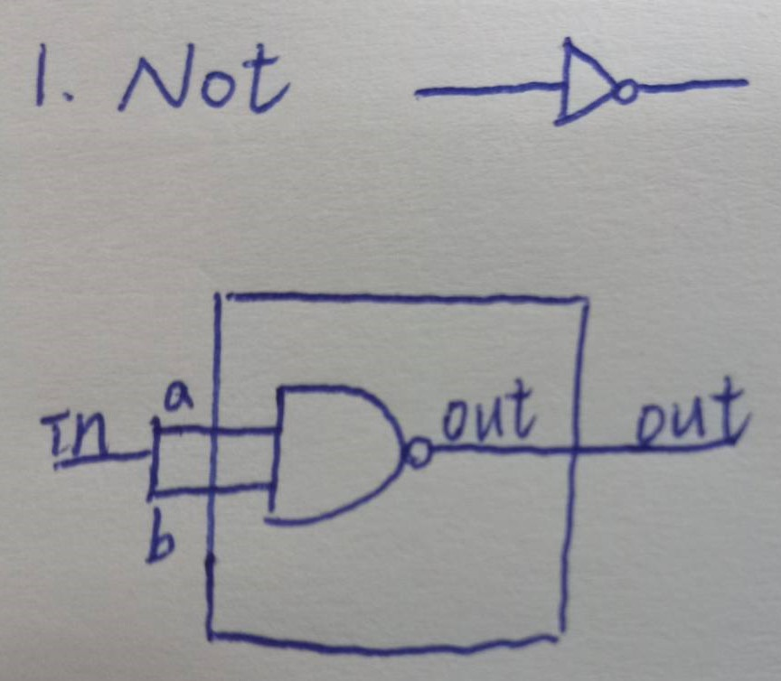
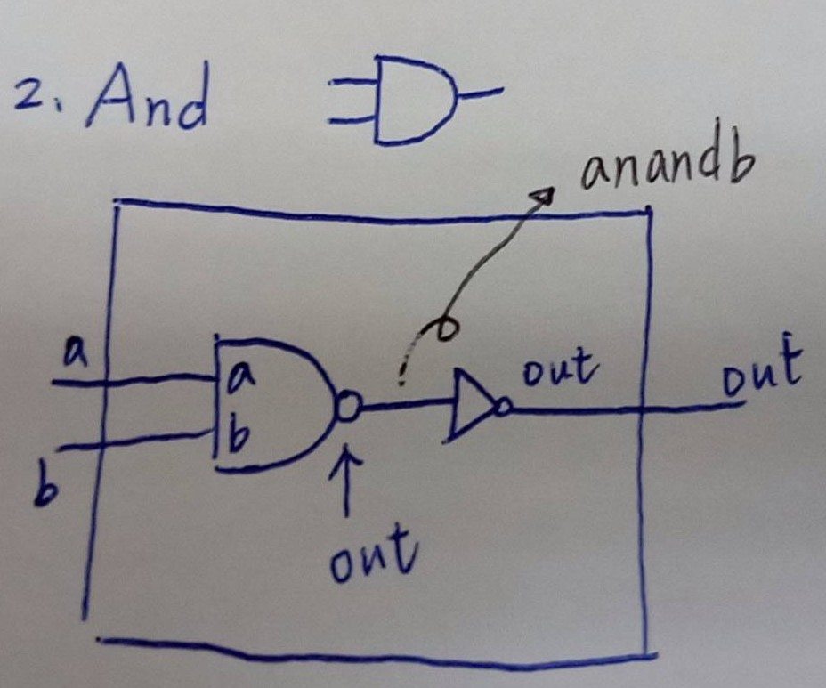
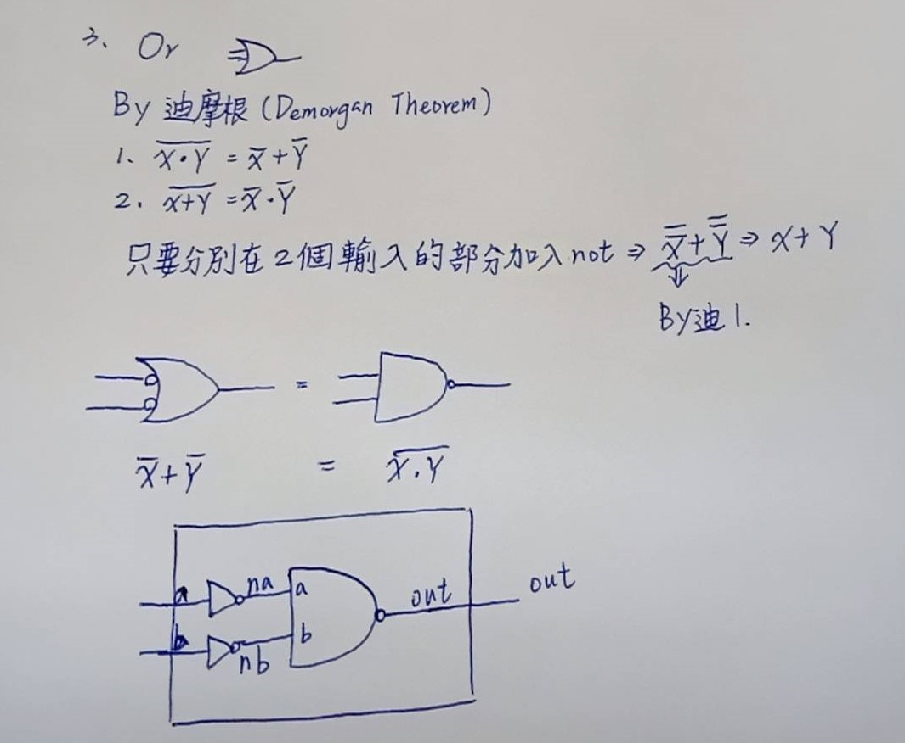

## 第一章前六題(Use Nand to do Not,And,Or，Xor，Mux，DMux)
### 1.Not 
>* code
```
// This file is part of www.nand2tetris.org
// and the book "The Elements of Computing Systems"
// by Nisan and Schocken, MIT Press.
// File name: projects/01/Not.hdl

/**
 * Not gate:
 * out = not in
 */

CHIP Not {
    IN in;
    OUT out;

    PARTS:
    // Put your code here:
    Nand(a=in, b=in, out=out); //a=in,b=in是內部皆限制外部
}
```
>* picture
  

### 2.And
>* code
```
// This file is part of www.nand2tetris.org
// and the book "The Elements of Computing Systems"
// by Nisan and Schocken, MIT Press.
// File name: projects/01/And.hdl

/**
 * And gate: 
 * out = 1 if (a == 1 and b == 1)
 *       0 otherwise
 */

CHIP And {  
    IN a, b;
    OUT out;

    PARTS:
    // Put your code here:
    Nand(a=a,b=b,out=AnandB);
    Not(in=AnandB,out=out);
}
```
>* 想法:Nand是And加一個Not.
>* picture


### 3.Or
>* code
```
 // This file is part of www.nand2tetris.org
// and the book "The Elements of Computing Systems"
// by Nisan and Schocken, MIT Press.
// File name: projects/01/Or.hdl

 /**
 * Or gate:
 * out = 1 if (a == 1 or b == 1)
 *       0 otherwise
 */

CHIP Or {
    IN a, b;
    OUT out;

    PARTS:
    // Put your code here:
    Not(in=a,out=na);
    Not(in=b,out=nb);
    Nand(a=na,b=nb,out=out);
}
```
>* Use the Demorgan Therem to use the two Not to let the Nand to Or
>* picture


### 4.Xor


